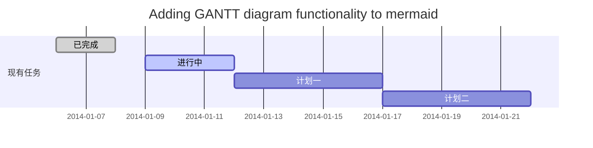
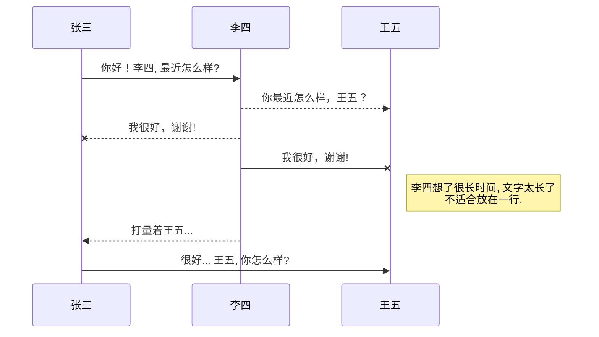
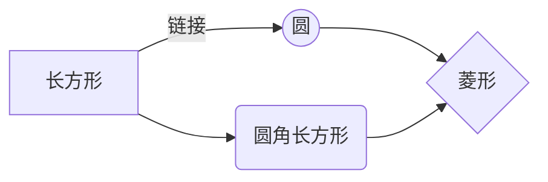

#Idea远程调试实战和Java调试原理讲解

## 前言
debug Java程序是Java程序员问题排查最有效的方式之一。通常，在开发或者测试过程中，都会依赖 IDE对程序进行debug操作。常用的IDE比如 IntelliJ IDEA 
和Eclipse都提供了完备 的 调试工具供开发者使用。
不过我们只和 IDE 打交道，IDE 和 JVM 之间在 debug 过程中有什么样的交互很多人并不清楚？而且我们通常是本地调试，如果是非本机调试，一般使用 remote debug 模式调试远端代码，那么本地调试和远程调试有什么异同吗？它们都是怎么 实现的？
我们通常用的JDK自带的命令行调试工具和Debug有关系吗？

命令	描述
jdb	命令行调试工具
jps	列出所有Java进程的PID
jstack	列出虚拟机进程的所有线程运行状态
jmap	列出堆内存上的对象状态
jstat	记录虚拟机运行的状态，监控性能
jconsole	虚拟机性能/状态检查可视化工具


## 一、远程debug
1、以调试模式启动项目

1.1、创建一个简单的演示项目example


1.2、用maven打包放到linux服务器上


1.3、用以下命令启动example
```
java -jar -Xdebug -Xrunjdwp:transport=dt_socket,server=y,suspend=n,address=9998 example-0.0.1-SNAPSHOT.jar >> ./test.out &
```
1.4、在本地idea上创建远程连接


1.5、向本地项目一样打断点对程序进行调试


##二、Java 调试原理

我们知道java程序都是运行在JVM上的，我们要调试 Java 程序，事实上就需要向 Java 虚拟机请求当前运行的状态，
并对虚拟机发出一定的指令，设置一些回调等等，由此推断，debug的过程肯定是JVM对此有专门的设计，这个设计就是JPDA

###2.1、Java调试体系JPDA简介

Java虚拟机设计了专门的API接口供调试和监控虚拟机使用，被称为Java平台调试体系即Java Platform Debugger Architecture(JPDA)。

###2.2、Java调试体系组成
JPDA按照抽象层次，又分为三层，分别是

- 2.2.1、JVM TI ： Java VM Tool Interface，虚拟机对外暴露的接口，包括debug和profile
- 2.2.2、JDWP ： Java Debug Wire Protocol，调试器和应用之间通信的协议
- 2.2.3、JDI ： Java Debug Interface，Java库接口，实现了JDWP协议的客户端，调试器可以用来和远程被调试应用通信

JPDA是一个典型的C/S应用，可以和HTTP做类比
IDE+JDI = 浏览器
JDWP = HTTP
JVMTI = RESTful接口
Debugee虚拟机= REST服务端


和其他的Java模块一样，Java只定义了Spec规范，也提供了参考实现（Reference Implementation），但是第三方完全可以参照这个规范，
按照自己的需要去实现其中任意一个组件，比如Eclipse就没有用Sun/Oracle的JDI，而是自己实现了一套，它的两个插件 org.eclipse.jdt.debug.ui 和
 org.eclipse.jdt.debug 与其强大的调试功能密切相关，其中 org.eclipse.jdt.debug.ui 是 Eclipse 调试工具界面的实现，
 而 org.eclipse.jdt.debug 则是 JDI 的一个完整实现。

###2.3、Java 虚拟机工具接口（JVMTI）

JVMTI（Java Virtual Machine Tool Interface）即指 Java 虚拟机工具接口，它是一套由虚拟机直接提供的 native 接口，它处于整个
 JPDA 体系的最底层，所有调试功能本质上都需要通过 JVMTI 来提供。通过这些接口，开发人员不仅调试在该虚拟机上运行的 Java 程序，还能查看它们运行的状态，
 设置回调函数，控制某些环境变量，从而优化程序性能。JVMTI 的前身是 JVMDI 和 JVMPI，它们原来分别被用于提供调试 Java 程序以及
  Java 程序调节性能的功能。 Java SE 7 后被JVMTI取代。

###2.4、Java 调试线协议（JDWP）

JDWP（Java Debug Wire Protocol）是一个为 Java 调试而设计的一个通讯交互协议，它定义了调试器和被调试程序之间传递的信息的格式。
在 JPDA 体系中，作为调试者（debugger）进程和被调试程序（debuggee）进程之间的交互数据的格式就是由 JDWP 来描述的，它详细完整地定义了请求命令、
回应数据和错误代码，保证了JVMTI 和 JDI 的通信通畅。比如在 Sun 公司提供的实现中，它提供了一个名为 jdwp.dll（jdwp.so）的动态链接库文件，
这个动态库文件实现了一个 Agent，它会负责解析JDI 发出的请求或者命令，并将其转化为 JVMTI 调用，然后将 JVMTI 函数的返回值封装成 JDWP 据发还给JDI 。

另外，这里需要注意的是 JDWP 本身并不包括传输层的实现，传输层需要独立实现，但是 JDWP 包括了和传输层交互的严格的定义，就是说，
JDWP 协议虽然不规定我们是通过 EMS 还是快递运送货物的，但是它规定了我们传送的货物的摆放的方式。在 Sun 公司提供的 JDK 中，在传输层上，
它提供了 socket 方式，以及在 Windows 上的 shared memory 方式。当然，传输层本身无非就是本机内进程间通信方式和远端通信方式，
所以本质上本地debug和远程debug原理是一样的，只是通信方式不同。

###2.5、Java 调试接口（JDI）
JDI（Java Debug Interface）是三个模块中最高层的接口，在多数的 JDK 中，它是由 Java 语言实现的。 通过它，
调试工具开发人员就能通过本地虚拟机上的调试器来操纵远程虚拟机上运行的程序，JDI 不仅能帮助开发人员格式化 JDWP 数据，
而且还能为 JDWP 数据传输提供队列、缓存等优化服务。从理论上说，开发人员只需使用 JDWP 和 JVMTI 即可支持跨平台的远程调试，
但是直接编写 JDWP 程序费时费力，而且效率不高。因此基于 Java 的 JDI 层的引入，简化了操作，提高了开发人员开发调试程序的效率。

##总结

整个JDPA有非常清晰的分层，各司其职，让整个调式过程简单可以扩展，而这一切其实都是构建在高司令巨牛逼的Java虚拟机抽象之上的，
通过JVMTI将抽象良好的虚拟机控制暴露出来，让开发者可以自由的掌控被调试的虚拟机。

而且由于规范的灵活性，如果有特殊需求，完全可以自己去重新实现和扩展，例如，我们可以通过agent去加密解密加载的类，
保护知识产权；我们可以记录虚拟机运行过程，作为自动化测试用例； 我们还可以把线上问题的诊断实践自动化下来，做一个快速预判 ，争取最宝贵的时间。

总之，通过 JPDA 这个标准，
我们可以从虚拟机中得到我们所需要的信息，完成我们所希望的操作，更好地开发我们的程序。而且，Java 调试工具是建立在强大的虚拟机上的，因此，
很多前沿的应用，比如动态编译运行，字节码的实时替换等等，都可以通过对虚拟机的改进而得到实现。
随着虚拟机技术的逐步发展和深入，各种不同种类，不同应用领域中虚拟机的出现，各种强大的功能的加入，给我们的调试工具也带来很多新的应用。


@[TOC](这里写自定义目录标题)

# 欢迎使用Markdown编辑器

你好！ 这是你第一次使用 **Markdown编辑器** 所展示的欢迎页。如果你想学习如何使用Markdown编辑器, 可以仔细阅读这篇文章，了解一下Markdown的基本语法知识。

## 新的改变

我们对Markdown编辑器进行了一些功能拓展与语法支持，除了标准的Markdown编辑器功能，我们增加了如下几点新功能，帮助你用它写博客：

 1. **全新的界面设计** ，将会带来全新的写作体验；
 2. 在创作中心设置你喜爱的代码高亮样式，Markdown **将代码片显示选择的高亮样式** 进行展示；
 3. 增加了 **图片拖拽** 功能，你可以将本地的图片直接拖拽到编辑区域直接展示；
 4. 全新的 **KaTeX数学公式** 语法；
 5. 增加了支持**甘特图的mermaid语法[^1]** 功能；
 6. 增加了 **多屏幕编辑** Markdown文章功能；
 7. 增加了 **焦点写作模式、预览模式、简洁写作模式、左右区域同步滚轮设置** 等功能，功能按钮位于编辑区域与预览区域中间；
 8. 增加了 **检查列表** 功能。
 [^1]: [mermaid语法说明](https://mermaidjs.github.io/)

## 功能快捷键

撤销：<kbd>Ctrl/Command</kbd> + <kbd>Z</kbd>
重做：<kbd>Ctrl/Command</kbd> + <kbd>Y</kbd>
加粗：<kbd>Ctrl/Command</kbd> + <kbd>B</kbd>
斜体：<kbd>Ctrl/Command</kbd> + <kbd>I</kbd>
标题：<kbd>Ctrl/Command</kbd> + <kbd>Shift</kbd> + <kbd>H</kbd>
无序列表：<kbd>Ctrl/Command</kbd> + <kbd>Shift</kbd> + <kbd>U</kbd>
有序列表：<kbd>Ctrl/Command</kbd> + <kbd>Shift</kbd> + <kbd>O</kbd>
检查列表：<kbd>Ctrl/Command</kbd> + <kbd>Shift</kbd> + <kbd>C</kbd>
插入代码：<kbd>Ctrl/Command</kbd> + <kbd>Shift</kbd> + <kbd>K</kbd>
插入链接：<kbd>Ctrl/Command</kbd> + <kbd>Shift</kbd> + <kbd>L</kbd>
插入图片：<kbd>Ctrl/Command</kbd> + <kbd>Shift</kbd> + <kbd>G</kbd>
查找：<kbd>Ctrl/Command</kbd> + <kbd>F</kbd>
替换：<kbd>Ctrl/Command</kbd> + <kbd>G</kbd>


## 合理的创建标题，有助于目录的生成

直接输入1次<kbd>#</kbd>，并按下<kbd>space</kbd>后，将生成1级标题。
输入2次<kbd>#</kbd>，并按下<kbd>space</kbd>后，将生成2级标题。
以此类推，我们支持6级标题。有助于使用`TOC`语法后生成一个完美的目录。


## 如何改变文本的样式

*强调文本* _强调文本_

**加粗文本** __加粗文本__

==标记文本==

~~删除文本~~

> 引用文本

H~2~O is是液体。

2^10^ 运算结果是 1024.


## 插入链接与图片

链接: [link](https://mp.csdn.net).

图片: 

带尺寸的图片: 

居中的图片: 

居中并且带尺寸的图片: 

当然，我们为了让用户更加便捷，我们增加了图片拖拽功能。


## 如何插入一段漂亮的代码片

去[博客设置](https://mp.csdn.net/configure)页面，选择一款你喜欢的代码片高亮样式，下面展示同样高亮的 `代码片`.
```javascript
// An highlighted block
var foo = 'bar';
```


## 生成一个适合你的列表

- 项目
  - 项目
    - 项目

1. 项目1
2. 项目2
3. 项目3

- [ ] 计划任务
- [x] 完成任务


## 创建一个表格
一个简单的表格是这么创建的：
项目     | Value
-------- | -----
电脑  | $1600
手机  | $12
导管  | $1

### 设定内容居中、居左、居右
使用`:---------:`居中
使用`:----------`居左
使用`----------:`居右
| 第一列       | 第二列         | 第三列        |
|:-----------:| -------------:|:-------------|
| 第一列文本居中 | 第二列文本居右  | 第三列文本居左 | 


### SmartyPants
SmartyPants将ASCII标点字符转换为“智能”印刷标点HTML实体。例如：
|    TYPE   |ASCII                          |HTML                         
|----------------|-------------------------------|-----------------------------|
|Single backticks|`'Isn't this fun?'`            |'Isn't this fun?'            |
|Quotes          |`"Isn't this fun?"`            |"Isn't this fun?"            |
|Dashes          |`-- is en-dash, --- is em-dash`|-- is en-dash, --- is em-dash|


## 创建一个自定义列表
Markdown
:  Text-to-HTML conversion tool

Authors
:  John
:  Luke


## 如何创建一个注脚

一个具有注脚的文本。[^2]

[^2]: 注脚的解释


##  注释也是必不可少的

Markdown将文本转换为 HTML。

*[HTML]:   超文本标记语言


## KaTeX数学公式

您可以使用渲染LaTeX数学表达式 [KaTeX](https://khan.github.io/KaTeX/):

Gamma公式展示 $\Gamma(n) = (n-1)!\quad\forall
n\in\mathbb N$ 是通过欧拉积分

$$
\Gamma(z) = \int_0^\infty t^{z-1}e^{-t}dt\,.
$$

> 你可以找到更多关于的信息 **LaTeX** 数学表达式[here][1].


## 新的甘特图功能，丰富你的文章


- 关于 **甘特图** 语法，参考 [这儿][2],

## UML 图表

可以使用UML图表进行渲染。 [Mermaid](https://mermaidjs.github.io/). 例如下面产生的一个序列图：:



这将产生一个流程图。:



- 关于 **Mermaid** 语法，参考 [这儿][3],

## FLowchart流程图

我们依旧会支持flowchart的流程图：
```mermaid
flowchat
st=>start: 开始
e=>end: 结束
op=>operation: 我的操作
cond=>condition: 确认？

st->op->cond
cond(yes)->e
cond(no)->op
```

- 关于 **Flowchart流程图** 语法，参考 [这儿][4].


## 导出与导入

###  导出
如果你想尝试使用此编辑器, 你可以在此篇文章任意编辑。当你完成了一篇文章的写作, 在上方工具栏找到 **文章导出** ，生成一个.md文件或者.html文件进行本地保存。

### 导入
如果你想加载一篇你写过的.md文件，在上方工具栏可以选择导入功能进行对应扩展名的文件导入，
继续你的创作。

 [1]: http://meta.math.stackexchange.com/questions/5020/mathjax-basic-tutorial-and-quick-reference
 [2]: https://mermaidjs.github.io/
 [3]: https://mermaidjs.github.io/
 [4]: http://adrai.github.io/flowchart.js/